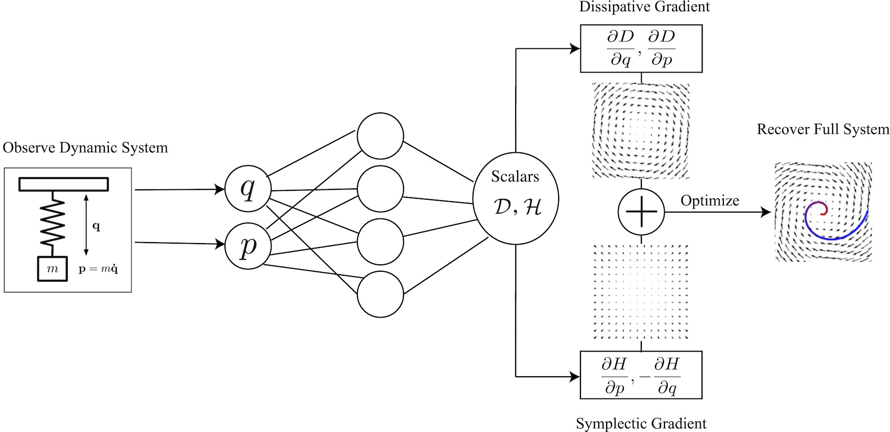

# Dissipative Hamiltonian Neural Networks
Andrew Sosanya, Sam Greydanus | 2020

* Paper: [https://arxiv.org/abs/2201.10085](https://arxiv.org/abs/2201.10085)
* Blog: [greydanus.github.io/2022/01/25/dissipative-hnns/](https://greydanus.github.io/2022/01/25/dissipative-hnns/)

_Dissipative HNNs (D-HNNs) output two scalar functions, denoted here by **H** and **D**. The first of these two, **H**, is the Hamiltonian. It is perfectly conserved. The second of these two, **D**, is the Rayleigh dissipation function. It models the dissipative component of the dynamics of a physical system. The addition of the dissipation function is what sets this model apart from Hamiltonian Neural Networks; it allows D-HNNs to model systems where energy is not quite conserved, as, for example, in the case of a damped mass-spring system._

Basic usage
--------

Use the .ipnyb notebooks to train and analyze all models

Summary
--------

We propose a simple way of extending Hamiltonian Neural Networks so as to model physical systems with dissipative forces. We call this model a Dissipative Hamiltonian Neural Network (D-HNN) because it adds support for dissipative dynamics.

Dependencies
--------
 * PyTorch
 * NumPy
 * ImageIO
 * Scipy
 
This project is written in Python 3.
