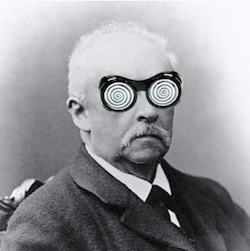

# Deep Helmholtz Decomposition
Andrew Sosanya, Sam Greydanus | 2020

* Paper: [arxiv.org/abs/1906.01563]()
* Blog: [greydanus.github.io/2019/05/15/hamiltonian-nns/]()

Basic usage
--------

Use the .ipnyb notebooks to train and analyze all models

Summary
--------

We propose a simple way of extending Hamiltonian Neural Networks so as to model physical systems with dissipative forces. We call this model a Deep Helmholtz Decomposition (DeepHHD) because it learns to model the conservative and dissipative components separately.

Dependencies
--------
 * PyTorch
 * NumPy
 * ImageIO
 * Scipy
 
This project is written in Python 3.